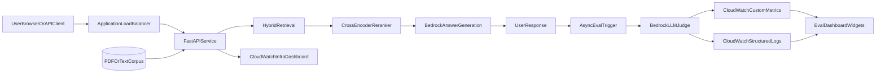

# RAG at Scale App Assembly Guide

This guide explains how to assemble, run, and deploy the complete application in a way that is easy to demo and safe to operate.

## What You Are Building

The repo contains two closely related application shapes:

- `rag-at-scale`: the baseline RAG demo app without LLM-as-judge enabled
- `rag-at-scale-eval`: the eval-enabled app that adds asynchronous judge scoring, CloudWatch custom metrics, and an eval-specific dashboard

Both apps use the same FastAPI service code and the same ECS Fargate + ALB deployment shape, but they run as separate stacks, services, and images so one can stay stable while the other is used for experiments and evaluation.

## Architecture



## Assembly Steps

### Step 1: Clone and set up the local Python environment

Create a Python 3.11 virtual environment, activate it, and install the local dependencies.

```bash
python3.11 -m venv venv
source venv/bin/activate
pip install --upgrade pip
pip install -r requirements.txt
pip install ipykernel jupyterlab nbconvert
```

### Step 2: Run the app locally

Start the FastAPI service:

```bash
uvicorn src.service.app:app --host 0.0.0.0 --port 8000 --reload
```

Useful endpoints:

- `GET /`
- `GET /health`
- `GET /docs`
- `POST /search`
- `POST /ingest`

### Step 3: Understand how documents enter the system

The application starts with a small `.txt` corpus from `data/raw/`.

Additional PDFs are ingested through `POST /ingest`:

1. text is extracted from the PDF
2. text is normalized and chunked
3. chunks are embedded
4. the hybrid index is updated
5. the total in-memory document count increases

Chunking currently happens in `src/service/ingest.py` using:

- chunk size: `500` characters
- overlap: `50` characters

### Step 4: Build the baseline production image

The main production image is defined in `docker/Dockerfile`.

That image:

1. installs the runtime dependencies
2. copies the app source and startup documents
3. pre-downloads the embedding and reranker models
4. runs the app through `uvicorn`

The baseline AWS deploy script is:

```bash
bash scripts/deploy_aws.sh
```

This provisions:

- ECR
- ECS Fargate
- ALB
- CloudWatch log group
- CloudWatch operational dashboard

### Step 5: Build the eval app as a separate image

The eval app uses the same service code but must not replace the baseline app image.

For that reason, the repo includes a separate image path:

- `docker/Dockerfile.eval`
- `requirements.eval.txt`
- `buildspec.eval.yml`
- `scripts/deploy_eval_app.sh`

The eval image strategy is intentionally conservative:

1. start from the already-working baseline production image
2. overlay only the updated `src/` tree
3. build remotely on native `amd64`
4. publish to a separate ECR repo

This prevents the current baseline app from being overwritten.

### Step 6: Deploy the baseline app stack

The baseline stack name and project name are:

- stack: `rag-at-scale`
- project: `rag-at-scale`

This creates resources such as:

- `rag-at-scale-cluster`
- `rag-at-scale-service`
- `/ecs/rag-at-scale-service`
- `rag-at-scale-observability`

### Step 7: Deploy the eval app stack

The eval stack uses a second, fully isolated name set:

- stack: `rag-at-scale-eval`
- project: `rag-at-scale-eval`
- ECR repo: `rag-at-scale-eval-service`
- dashboard: `rag-at-scale-eval-observability`
- metric namespace: `RAGAtScaleEval/Application`

Deploy it with:

```bash
bash scripts/deploy_eval_app.sh deploy
```

This path:

1. packages the eval source bundle
2. uploads it to S3
3. triggers an AWS CodeBuild job on native `amd64`
4. pushes the eval image into its own ECR repo
5. deploys a second ECS Fargate stack with eval flags enabled

### Step 8: Verify operational observability

The baseline dashboard shows operational metrics such as:

- ECS CPU and memory
- request count
- target latency
- HTTP errors
- healthy targets
- logs

The eval dashboard adds:

- `FaithfulnessScore`
- `ContextPrecisionScore`
- `ContextCoverageScore`
- `AnswerRelevancyScore`
- `EvalSampleCount`
- application latency metrics such as search, rerank, generation, and end-to-end latency

### Step 9: Verify the LLM-as-judge flow

The eval app runs the judge asynchronously after the user response is already sent.

Inputs used by the judge:

- user query
- reranked chunks
- final answer

Outputs written to CloudWatch:

- custom metrics
- structured logs containing the judge verdict and per-score values

## Safe Operating Rules

To keep demos stable:

1. never update the baseline `rag-at-scale` stack while preparing the eval app
2. never push eval builds into the baseline ECR repo
3. use separate stack names, service names, dashboards, and metric namespaces
4. treat the eval app as disposable and the baseline app as the safe fallback

## Suggested Demo Flow

1. Open the baseline app to show the stable production path.
2. Open the eval app to show the same search experience plus extra observability.
3. Ingest the `nexus_research_bulletin_2025.pdf` into the eval app.
4. Ask a fact-rich question.
5. Show the answer, retrieved chunks, then the eval dashboard and CloudWatch logs.

## Key Files

- `README.md`
- `SETUP.md`
- `DEPLOYMENT_STATUS.md`
- `src/service/handlers.py`
- `src/service/ingest.py`
- `src/observability/evals.py`
- `src/observability/metrics.py`
- `cloudformation/ecs-fargate-alb.yaml`
- `scripts/deploy_aws.sh`
- `scripts/deploy_eval_app.sh`
